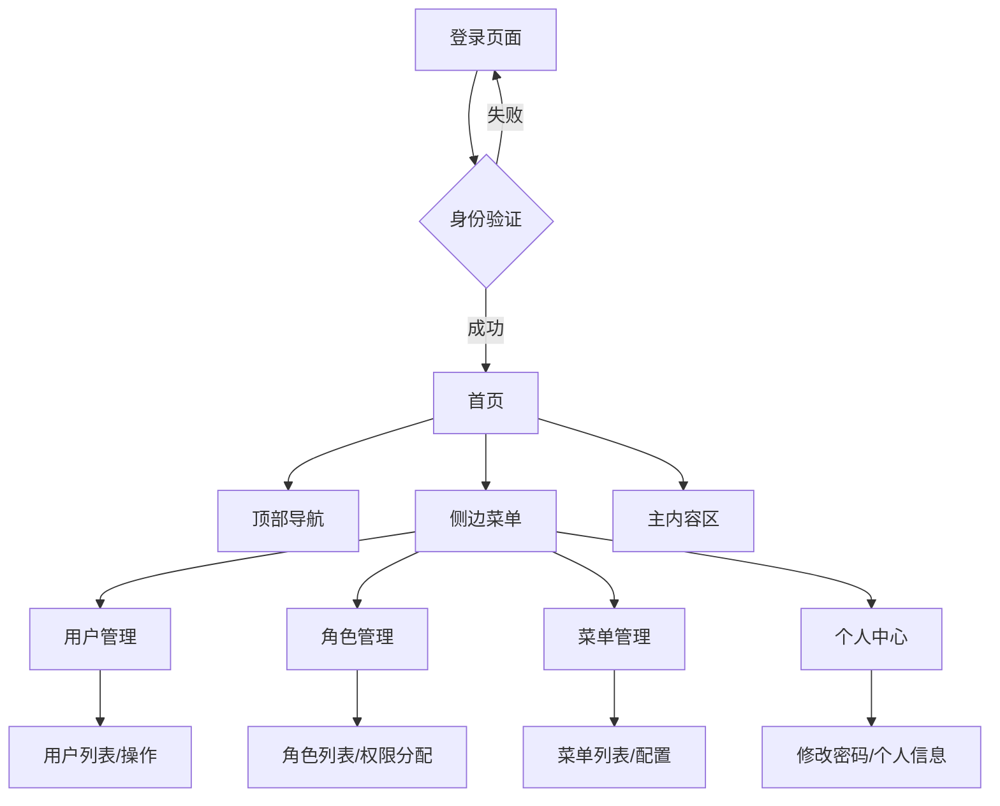

## 1. 产品概述
本系统是一个通用的后台管理系统框架，提供完整的用户权限管理功能。支持登录认证、用户管理、角色管理和菜单权限管理，采用Vue3 + JavaScript + Element Plus + Pinia技术栈，具有后端动态路由生成、响应式布局等特性。

适用于各类企业和组织的后台管理系统，解决权限控制、用户管理、系统配置等核心需求。

## 2. 核心功能

### 2.1 用户角色
| 角色 | 注册方式 | 核心权限 |
|------|----------|----------|
| 超级管理员 | 系统初始化创建 | 拥有所有权限，包括系统配置、用户管理、角色管理、菜单管理 |
| 管理员 | 超级管理员创建 | 根据分配的角色权限，管理特定模块和用户 |
| 普通用户 | 管理员创建 | 根据分配的角色权限，访问特定功能和数据 |

### 2.2 功能模块
系统包含以下核心页面：
1. **登录页面**：用户身份验证、记住密码、验证码
2. **首页**：系统概览、快捷入口、数据统计
3. **用户管理**：用户列表、添加用户、编辑用户、删除用户、重置密码
4. **角色管理**：角色列表、创建角色、编辑角色、删除角色、权限分配
5. **菜单管理**：菜单列表、添加菜单、编辑菜单、删除菜单、菜单排序
6. **个人中心**：修改密码、修改个人信息、头像上传

### 2.3 页面详情
| 页面名称 | 模块名称 | 功能描述 |
|----------|----------|----------|
| 登录页面 | 登录表单 | 输入用户名密码进行身份验证，支持记住密码功能 |
| 登录页面 | 验证码 | 防止暴力破解，增强安全性 |
| 首页 | 顶部导航 | 显示系统名称、用户头像昵称、退出登录 |
| 首页 | 侧边菜单 | 可折叠的菜单导航，根据用户权限动态显示 |
| 首页 | 主内容区 | 显示当前页面内容，包含面包屑导航 |
| 用户管理 | 用户列表 | 分页显示所有用户，支持搜索、筛选、排序 |
| 用户管理 | 用户操作 | 新增用户、编辑用户、删除用户、重置密码、启用禁用 |
| 角色管理 | 角色列表 | 分页显示所有角色，支持搜索、筛选 |
| 角色管理 | 角色操作 | 新增角色、编辑角色、删除角色、权限配置 |
| 角色管理 | 权限分配 | 树形结构展示菜单权限，支持批量选择和取消 |
| 菜单管理 | 菜单列表 | 树形结构展示系统菜单，支持拖拽排序 |
| 菜单管理 | 菜单操作 | 新增菜单、编辑菜单、删除菜单、设置图标和路由 |
| 个人中心 | 修改密码 | 用户自行修改登录密码 |
| 个人中心 | 个人信息 | 修改昵称、邮箱、手机号、上传头像 |

## 3. 核心流程

### 超级管理员流程
1. 登录系统 → 进入首页 → 查看系统概览
2. 菜单管理 → 配置系统菜单结构 → 设置菜单权限
3. 角色管理 → 创建角色 → 分配菜单权限 → 保存角色
4. 用户管理 → 创建用户 → 分配角色 → 设置用户状态

### 管理员流程
1. 登录系统 → 进入首页 → 查看有权限的模块
2. 用户管理 → 管理部门用户 → 分配对应角色
3. 根据权限访问相应功能模块

### 普通用户流程
1. 登录系统 → 进入首页 → 查看个人权限内的功能
2. 使用分配的功能模块 → 进行业务操作
3. 个人中心 → 修改个人信息和密码



## 4. 用户界面设计

### 4.1 设计规范
- **主色调**：蓝色系（#409EFF作为主色，#67C23A作为成功色，#E6A23C作为警告色，#F56C6C作为错误色）
- **辅色调**：白色背景，灰色文字（#303133主要文字，#606266常规文字，#C0C4CC占位文字）
- **按钮样式**：圆角矩形，主按钮使用蓝色，次要按钮使用白色边框
- **字体**：系统默认字体，主要文字14px，标题16-18px，小字12px
- **布局风格**：顶部导航+侧边菜单的经典后台布局，卡片式内容区域
- **图标风格**：使用Element Plus图标库，线性图标为主

### 4.2 页面设计
| 页面名称 | 模块名称 | UI元素 |
|----------|----------|--------|
| 登录页面 | 登录卡片 | 居中卡片布局，宽度400px，白色背景，蓝色主按钮，包含用户名、密码输入框和验证码 |
| 首页 | 顶部导航 | 高度60px，左侧系统logo和名称，右侧用户头像昵称下拉菜单，蓝色背景白色文字 |
| 首页 | 侧边菜单 | 宽度200px（可折叠），深蓝色背景，白色文字，图标+文字形式，支持多级菜单 |
| 首页 | 主内容区 | 白色背景，顶部面包屑导航，下方内容区域，内边距20px |
| 用户管理 | 用户列表 | 白色卡片，包含搜索栏、操作按钮、数据表格，表格行高48px |
| 角色管理 | 权限树 | 使用Element Tree组件，支持父子节点关联选择，蓝色选中状态 |
| 菜单管理 | 菜单树 | 拖拽排序功能，图标选择器，路由配置输入框 |
| 个人中心 | 信息表单 | 两栏表单布局，左侧头像上传，右侧信息输入，保存按钮蓝色主色调 |

### 4.3 响应式设计
- **桌面优先**：优先适配1920×1080、1440×900、1366×768等常见分辨率
- **平板适配**：768px-1024px屏幕，侧边菜单可收起，内容区域自适应
- **移动端**：小于768px时，侧边菜单变为抽屉式，表格横向滚动
- **交互优化**：鼠标悬停效果，点击反馈，加载动画，操作确认提示

### 4.4 动态路由生成机制
**核心特性**：
- **后端驱动**：所有菜单和路由配置完全由后端返回，前端不做硬编码
- **实时同步**：用户登录后动态获取个人权限菜单，实时生成对应路由
- **权限控制**：后端根据用户角色过滤菜单数据，确保安全性
- **组件映射**：后端返回的组件路径自动映射到前端页面组件
- **多级嵌套**：支持无限级菜单嵌套，自动生成嵌套路由结构

**实现原理**：
1. 用户登录成功后，调用`/auth/getInfo`接口获取用户信息和菜单数据
2. 后端返回的菜单数据包含：菜单ID、名称、路由路径、组件路径、图标、排序、权限标识
3. 前端使用JavaScript将菜单数据递归转换为Vue Router路由配置
4. 通过`router.addRoute()`方法动态添加路由到路由表中
5. 使用Pinia存储用户菜单数据，支持响应式更新侧边栏

**数据格式示例**：
```json
{
  "menus": [{
    "id": "2",
    "name": "用户管理",
    "path": "user",
    "component": "pages/system/user/index",
    "perms": "system:user:list",
    "children": []
  }]
}
```